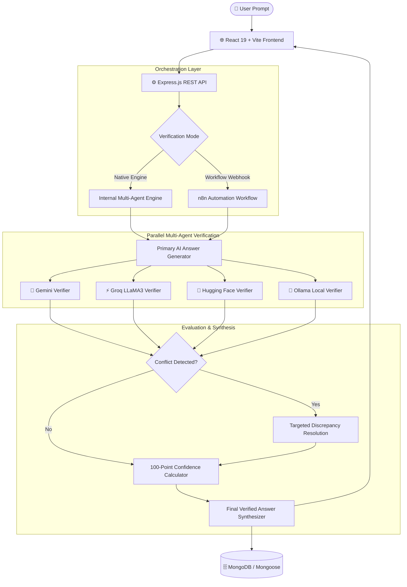

# 🛡️ VerifyAI — Multi-Agent AI Answer Verification & Fact-Checking Platform

<p align="center">
  <strong>One Question. Parallel Multi-Model AI Verification. Conflict Resolution. One Trustworthy Final Answer.</strong>
</p>

<p align="center">
  
  
  
  
  
  
  
</p>

---

## 📌 Overview

**VerifyAI** is an automated fact-checking and verification platform engineered to eliminate AI hallucinations and factual inaccuracies. 

Instead of overwhelming users with conflicting outputs from multiple chatbots, **VerifyAI executes an autonomous verification pipeline**:
1. Generates an initial candidate answer from a primary model.
2. Deploys independent secondary AI agents (**Google Gemini**, **Groq LLaMA-3**, **Hugging Face**) to fact-check the claim in parallel.
3. Automatically detects cross-agent discrepancies and runs targeted conflict resolution.
4. Computes a mathematical **100-Point Confidence Score** based on multi-source agreement, evidence strength, and source reliability.
5. Synthesizes and delivers **one verified, authoritative final answer** accompanied by source citations and full audit transparency.

---

## 🚀 Key Features

- 🎯 **Single Unified Answer**: Users receive a clean, verified final answer rather than having to manually compare conflicting AI responses.
- 📰 **Free Live Global News Stream**: Ingests breaking news across World, Tech, Business, Science, Health, and Politics using Google News RSS feeds (100% Free, zero API cost).
- 📖 **Wikipedia Fact Grounding**: Real-time retrieval of encyclopedic extracts and verified entity definitions via Wikipedia Open REST API.
- ⚡ **Parallel Multi-Agent Verification**: Dispatches concurrent verification tasks across Google Gemini, Groq (LLaMA 3), Hugging Face, and Ollama.
- 🔍 **Automated Conflict Detection & Resolution**: Identifies contradictions between models and triggers re-verification to reconcile discrepancies.
- 📊 **100-Point Weighted Confidence Scoring**: Computes objective confidence ratings categorized into *Very High*, *High*, *Moderate*, *Low*, and *Unable to Verify*.
- 💬 **Evidence Quotes & Citation Transparency**: Displays verified reference excerpts and direct links to Wikipedia and original news publishers.
- 🧪 **Zero-Config Demo Mode**: Works out of the box without requiring API keys using intelligent simulated verification flows.
- 📈 **Interactive Analytics & Dashboard**: Visualize verification accuracy trends, confidence distribution, response latency, and agent performance using interactive Recharts.
- 📚 **Transparent Source Registry**: Complete traceability for all verified knowledge bases and evidence citations.
- 🔄 **n8n Workflow Automation**: Includes a ready-to-import n8n orchestration workflow (`n8n/verification-workflow.json`) for production pipelines.
- 🎨 **Modern Responsive UI**: Built with a sleek White + Emerald Green theme, fluid animations, and mobile-responsive layouts.

---

## 🏗️ Architecture & Pipeline Flow



---

## 🧮 Confidence Scoring System

VerifyAI scores every verified answer using a weighted algorithm out of 100 points:

| Factor | Weight | Evaluation Criteria |
| :--- | :---: | :--- |
| **AI Multi-Model Agreement** | **30 pts** | Consensus ratio across independent AI verifier agents |
| **Evidence & Fact Support** | **30 pts** | Citations, factual consistency, and verified data points |
| **Source Authority & Reliability** | **25 pts** | Trust score of referenced databases, academic, and web sources |
| **Internal Semantic Consistency** | **15 pts** | Logical cohesion and absence of internal contradiction |
| **Total** | **100 pts** | Maximum Confidence Score |

### Confidence Classification

| Score Range | Rating Level | Badge Color | Description |
| :---: | :---: | :---: | :--- |
| **90 – 100** | **Very High** | 🟢 Green | Complete cross-agent consensus and rigorous evidence |
| **75 – 89** | **High** | 🟢 Emerald | Strong agreement across primary sources |
| **60 – 74** | **Moderate** | 🟡 Yellow | Minor minor nuances or partial source confirmation |
| **40 – 59** | **Low** | 🟠 Orange | Significant divergence or weak evidentiary backing |
| **0 – 39** | **Unable to Verify** | 🔴 Red | Unsubstantiated or heavily conflicting claims |

---

## 💻 Tech Stack

### Frontend
- **Framework**: React 19, Vite
- **Routing**: React Router DOM v7
- **Icons**: Lucide React
- **Data Visualization**: Recharts
- **Styling**: Vanilla CSS Design System (Custom tokens, glassmorphism, responsive grid)

### Backend
- **Runtime**: Node.js (v18+)
- **Framework**: Express.js
- **Database**: MongoDB with Mongoose ODM
- **Security**: Helmet, Express Rate Limit, CORS
- **Logging**: Morgan & custom request logging

### AI & Automation Integrations
- **Google Gemini API** (`gemini-1.5-flash` / `gemini-1.5-pro`)
- **Groq Cloud API** (`llama-3.3-70b-versatile`)
- **Hugging Face Inference API**
- **Ollama** (Local LLMs)
- **n8n Workflow Automation Engine**

---

## 📁 Repository Structure

```
VerifyAI/
├── 📁 frontend/                 # React + Vite frontend application
│   ├── 📁 public/               # Static web assets
│   ├── 📁 src/
│   │   ├── 📁 components/       # Reusable UI components & modals
│   │   ├── 📁 hooks/            # Custom React hooks (useVerification)
│   │   ├── 📁 layouts/          # Header, Sidebar, AppLayout
│   │   ├── 📁 pages/            # Dashboard, Verify, History, Analytics, Sources, Settings
│   │   ├── 📁 services/         # API integration services (api.js)
│   │   ├── 📁 styles/           # Global styles and design system variables
│   │   └── 📁 utils/            # Formatting and helper utilities
│   ├── .env.example             # Frontend environment template
│   ├── package.json             # Frontend dependencies and build scripts
│   └── vite.config.js           # Vite configuration
│
├── 📁 backend/                  # Node.js + Express REST API backend
│   ├── 📁 config/               # Database connection (database.js) & migrations (migrate.js)
│   ├── 📁 controllers/          # Route controller handlers
│   ├── 📁 middleware/           # Error handling, request logging, rate limits
│   ├── 📁 models/               # Mongoose schemas (Verification, Source, Agent, Settings)
│   ├── 📁 routes/               # API route definitions (/verify, /analytics, /sources, etc.)
│   ├── 📁 services/             # Verification engine, demo service, AI providers
│   │   ├── 📁 aiProviders/      # Gemini, Groq, Hugging Face client adapters
│   │   ├── demoService.js       # Demo mode simulation engine
│   │   ├── n8nService.js        # n8n webhook integration
│   │   ├── settingsService.js   # Dynamic settings management
│   │   └── verificationEngine.js# Core multi-agent pipeline
│   ├── 📁 test/                 # Test scripts (test_api.js)
│   ├── .env.example             # Backend environment template
│   ├── package.json             # Backend dependencies and scripts
│   └── server.js                # Express application entrypoint
│
├── 📁 n8n/                      # n8n Automation Workflows
│   └── verification-workflow.json # Ready-to-import n8n workflow
│
├── .env.example                 # Root environment template
├── .gitignore                   # Git ignore configuration
├── package.json                 # Monorepo orchestration scripts
└── README.md                    # Project documentation
```

---

## ⚡ Getting Started

### Prerequisites

Ensure you have the following installed on your system:
- **Node.js**: `v18.0.0` or later (`v20+` recommended)
- **npm**: `v9.0.0` or later
- **MongoDB**: Community Server running locally on port `27017` or a MongoDB Atlas connection string

---

### Installation Steps

#### 1. Clone the Repository
```bash
git clone https://github.com/your-username/VerifyAI.git
cd VerifyAI
```

#### 2. Install Dependencies
You can install dependencies for the entire workspace in one command:
```bash
npm run install:all
```
*Or install manually in each directory:*
```bash
# Backend
cd backend && npm install

# Frontend
cd ../frontend && npm install
```

#### 3. Configure Environment Variables

**Backend Configuration:**
```bash
# In the backend directory (or root)
cp backend/.env.example backend/.env
```
Open `backend/.env` and update your settings:
```env
PORT=5000
NODE_ENV=development
FRONTEND_URL=http://localhost:5173
MONGODB_URI=mongodb://localhost:27017/verifyai

# AI Keys (Optional — leave blank for Demo Mode)
GEMINI_API_KEY=your_gemini_api_key_here
GROQ_API_KEY=your_groq_api_key_here
HUGGINGFACE_API_KEY=your_huggingface_api_key_here
```

**Frontend Configuration (Optional):**
```bash
# In the frontend directory
cp frontend/.env.example frontend/.env.local
```

---

### Running the Application

#### Start MongoDB
Make sure MongoDB is running on your machine:
```bash
# Windows
net start MongoDB

# macOS (Homebrew)
brew services start mongodb-community

# Linux (systemd)
sudo systemctl start mongod
```

#### Start Backend & Frontend

Open two terminal tabs:

**Terminal 1 — Backend:**
```bash
npm run backend
# Or: cd backend && npm run dev
```
> Server runs on `http://localhost:5000` (Database auto-seeds on initial boot).

**Terminal 2 — Frontend:**
```bash
npm run frontend
# Or: cd frontend && npm run dev
```
> Frontend client runs on `http://localhost:5173`.

---

## 🧪 Demo Mode

VerifyAI includes a **built-in Demo Mode** that allows full testing without configuring any paid AI API keys.

- When `GEMINI_API_KEY` and `GROQ_API_KEY` are unset, VerifyAI automatically activates Demo Mode.
- Fully simulates primary generation, parallel agent review, conflict detection, resolution, and confidence scoring.
- Try asking:
  - `"Who invented the telephone?"` *(triggers historical conflict resolution between Bell and Meucci)*
  - `"Who discovered penicillin?"` *(high-confidence consensus verification)*
  - `"What is quantum computing?"` *(multi-source technical consensus)*
  - `"What is the current population of India?"` *(real-time statistical verification)*

---

## 🔌 API Reference

### Health Check
```http
GET /api/health
```
**Response:**
```json
{
  "status": "ok",
  "version": "1.0.0",
  "services": {
    "database": "connected",
    "gemini": "configured",
    "groq": "configured",
    "demoMode": false
  }
}
```

### Submit Question for Verification
```http
POST /api/verify
Content-Type: application/json

{
  "question": "Who invented the telephone?"
}
```
**Response:**
```json
{
  "id": "c7b5a190-2c9e-4e42-99d8-bf88d745dfb0",
  "question": "Who invented the telephone?",
  "answer": "While Alexander Graham Bell was awarded the first official patent for the electrical telephone in 1876, Antonio Meucci is recognized by the U.S. Congress (H.Res. 269) for his earlier work on voice communication apparatus...",
  "confidence": 82,
  "confidenceLevel": "high",
  "status": "conflict_resolved",
  "sources": ["Smithsonian Institution", "U.S. Library of Congress", "Wikipedia"],
  "verificationSummary": {
    "aiAgreement": true,
    "evidenceFound": true,
    "conflictDetected": true,
    "conflictResolved": true
  },
  "demoMode": false
}
```

| Method | Route | Description |
| :--- | :--- | :--- |
| `GET` | `/api/news` | Stream live breaking news headlines categorized (World, Tech, Business, Science, Health, etc.) |
| `GET` | `/api/news/search?q=...` | Search live real-time news articles from Google News RSS |
| `GET` | `/api/news/wikipedia?q=...` | Search Wikipedia encyclopedic articles and extracts |
| `GET` | `/api/news/grounding?q=...` | Fetch combined Google News and Wikipedia fact-checking evidence snippets |
| `GET` | `/api/verifications` | Retrieve paginated history of all verifications |
| `GET` | `/api/verifications/:id` | Get detailed verification trace and agent audit logs |
| `GET` | `/api/analytics` | Get aggregate statistics, accuracy rates, and chart data |
| `GET` | `/api/sources` | List all verified reference sources and usage counts |
| `GET` | `/api/settings` | Get current verification thresholds and provider statuses |
| `PUT` | `/api/settings` | Update scoring weights and enabled AI models |

---

## ⚙️ n8n Workflow Integration

VerifyAI supports workflow orchestration via **n8n**:

1. Install and launch n8n: `n8n start` (runs at `http://localhost:5678`).
2. Go to **Workflows → Import from File** and select `n8n/verification-workflow.json`.
3. Add your AI credentials in n8n (Google Gemini, Groq, Hugging Face).
4. Activate the workflow and copy the **Production Webhook URL**.
5. Set `N8N_WEBHOOK_URL=http://localhost:5678/webhook/verify` in your `backend/.env`.

---

## 🛡️ Security & Best Practices

- **Never commit `.env` files**: All secret keys and `.env*` files are strictly ignored via `.gitignore`.
- **Rate Limiting**: Built-in protection on API endpoints to prevent request abuse.
- **Helmet Security**: Strict HTTP headers and cross-origin resource isolation.

---

## 🤝 Contributing

Contributions are welcome! Please feel free to submit a Pull Request.

1. Fork the repository
2. Create your feature branch (`git checkout -b feature/AmazingFeature`)
3. Commit your changes (`git commit -m 'Add some AmazingFeature'`)
4. Push to the branch (`git push origin feature/AmazingFeature`)
5. Open a Pull Request

---

## 📄 License

This project is licensed under the MIT License — see the [LICENSE](LICENSE) file for details.
